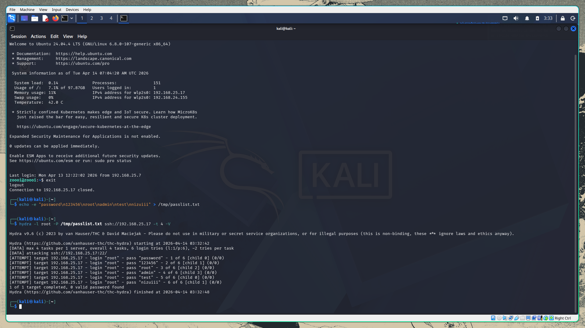
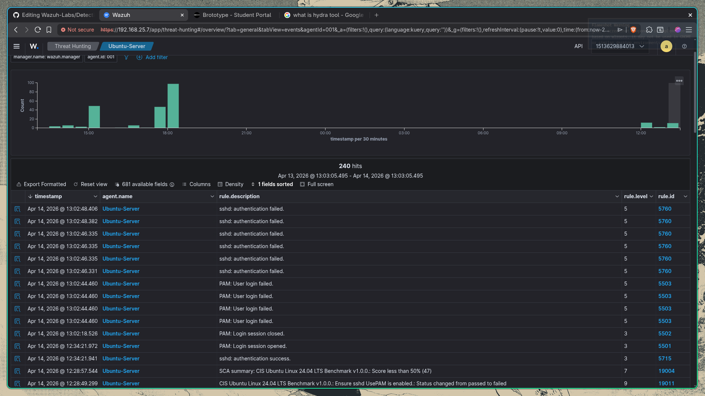

# Lab showcasing SSH Brute Force Attack

In this lab we are going to perform a SSH bruteforce against our ubuntu server with wazug agent installed. So before we bruteforce lets check whether normal ssh connection is establishing. So for that lets connect to the ubuntu machine from our kali first.


From these 2 images its clear that the SSH connection is established and even in the wazuh event manager we can see the event specifying the SSH connection is success. This confirms that SSH is working and wazuh is logging everything properly.

Now lets start attacking the ubuntu server. In this scenario we will be using hydra which is a password cracker tool. So first we have to create a normal wordlist so that we could store some random passwords inorder for the bruteforce attack to guess.

```bash
echo -e "password\n123456\nroot\nadmin\ntest\nnizuiii" > /tmp/passlist.txt
```

Next we will be using hydra inorder to initiate our bruteforce attack and we will be using a false username called root.

```bash
hydra -l root -P /tmp/passlist.txt ssh://192.168.25.17 -t 4 -V 
```



And we can see that the attack has been occured and now lets check the wazuh events to find if anything suspicious occured.


