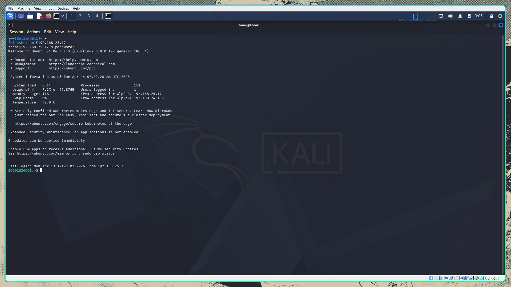
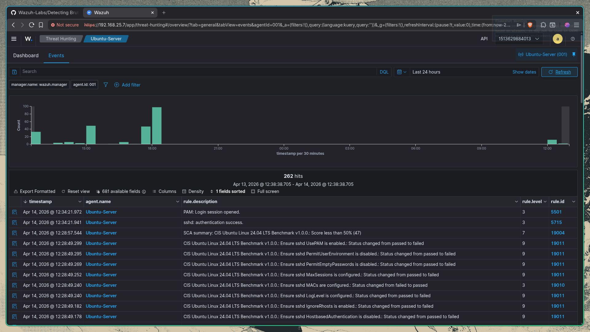

# Lab showcasing SSH Brute Force Attack

In this lab we are going to perform a SSH bruteforce against our ubuntu server with wazug agent installed. So before we bruteforce lets check whether normal ssh connection is establishing. So for that lets connect to the ubuntu machine from our kali first.

From these 2 images its clear that the SSH connection is established and even in the wazuh event manager we can see the event specifying the SSH connection is success. This confirms that SSH is working and wazuh is logging everything properly. 
