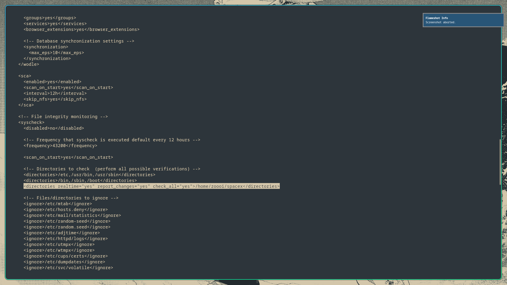
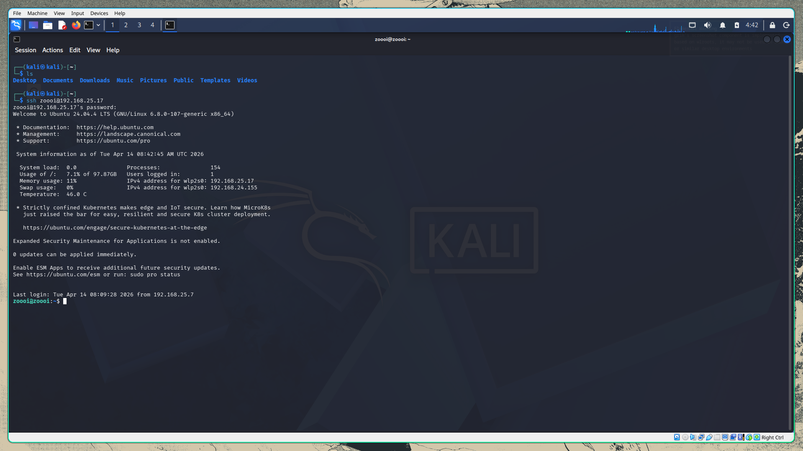
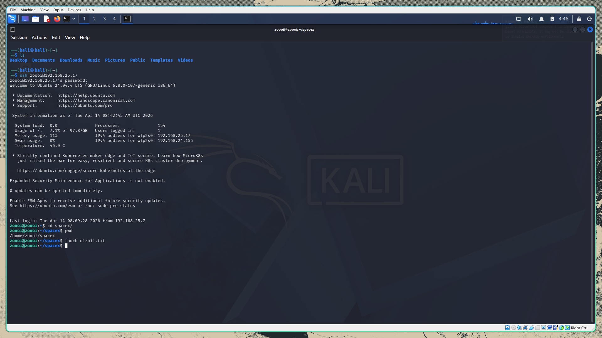
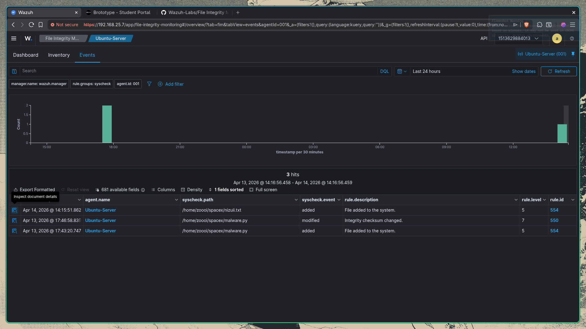
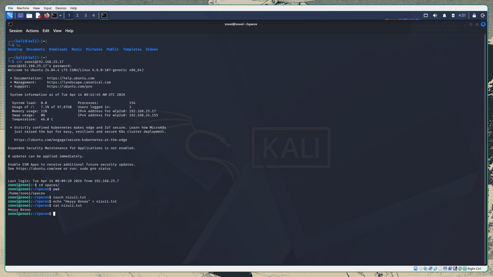
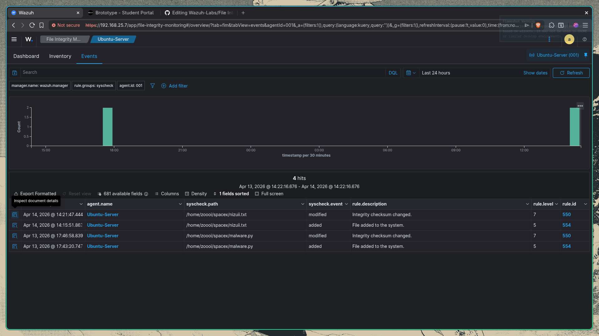
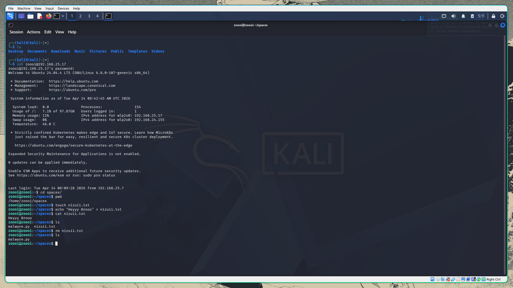
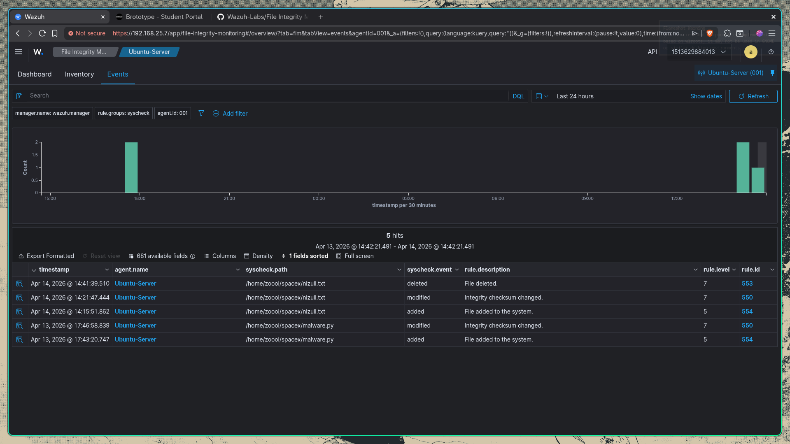

# FIM - Lab

In this lab we are going to check **File Integrity Monitoring**. So our goal is to monitor a specific directory in our ubuntu server and that specific directory is `/home/zoooi/spacex`. So before we monitor that directory we need to tell our agent by adding this following line in `<syscheck>` block.
```bash
<directories realtime="yes" report_changes="yes" check_all="yes">/home/zoooi/spacex</directories>
```


This tells the agent to monitor this specific directories along with the other default monitoring directories. And right after adding we need to restart the wazuh agent to make the effect in action so we have to run:

```bash
sudo systemctl restart wazuh-agent
```

So right after restarting the wazuh agent, lets head back to our kali machine and establish an SSH connection inorder to make it more realistic.


So we can see that the SSH connection to our ubuntu from kali is established successfully. So now our next goal is to move to the spacex directory and create a new file called `nizuii.txt`.




We can see that right after creating nizuii.txt file inside `/home/zoooi/spacex`, Wazuh has already shows the alert `File added to the system`. Now lets try modifying this `nizuii.txt` file.

 
 

Here we can see that right after we modified the `nizuii.txt` file by adding some contents to it, wazuh generated another alert called: `Integrity checksum changed`. Now lets try deleting `nizuii.txt` file.



